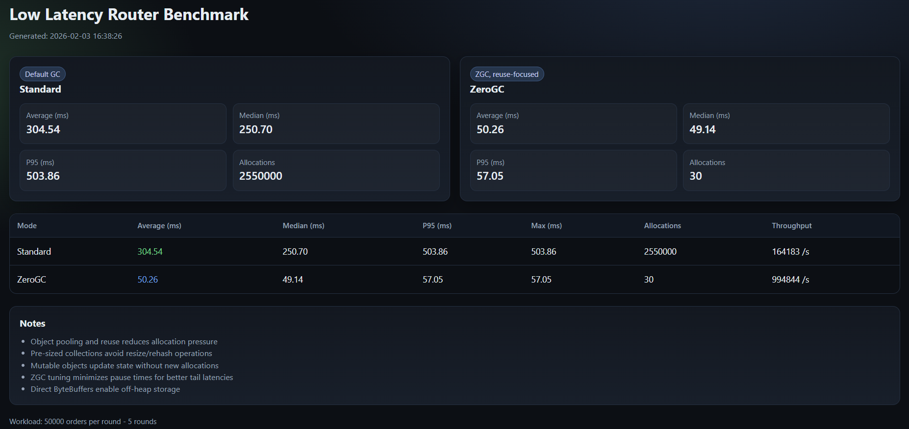

# Low Latency Trading Router Benchmark

This project demonstrates the impact of zeroGC techniques on a realistic trading workflow built with Java 21.

## Key Features

- **Real-world use case**: Simulates a trading order processing system
- **Zero GC mode**: Object reuse, pooling and ZGC optimization
- **Benchmark**: Side-by-side comparison of standard vs. zero GC approaches
- **Simple implementation**: Minimal logging dependencies (SLF4J + Logback)
- **HTML report**: Visual comparison in `build/reports/benchmark.html`

## Sample Report

## About the "ZeroGC" Mode

The term "ZeroGC" in this project is used to illustrate object pooling and reuse concepts, but is not truly "zero garbage collection" in the strict sense. In production trading systems, true zero-GC approaches typically involve:

1. **Off-heap memory**: Using DirectByteBuffers and Unsafe for manual memory management
2. **Value types**: Using stack allocation where possible (Project Valhalla will improve this)
3. **Custom memory management**: Implementing specialized allocators for specific use cases
4. **Disruptor pattern**: Using pre-allocated ring buffers for inter-thread communication

This simplified example focuses on the basic techniques of object pooling and reuse to reduce allocation pressure, which is just the first step toward building truly pauseless systems.

## Project Structure

This project is designed to be simple and self-contained:

- **TradingRouterBenchmarkApp**: CLI entry point
- **BenchmarkRunner**: Orchestrates runs, summaries, and report generation
- **HtmlReportBuilder**: Generates the HTML comparison report
- **Benchmark package**: Contains additional zero-GC technique examples (for educational purposes)

## Educational Resources

This project includes additional code that is not used by TradingRouterBenchmarkApp but is kept for educational purposes:

- **Benchmark package**: Reference implementations of various zero-GC techniques:
  - ObjectPoolReference - Demonstrates object pooling
  - StringInternReference - Shows string interning for avoiding duplicates
  - ThreadAffinityReference - Demonstrates thread-to-core pinning
  - DirectBufferReference - Shows off-heap memory usage
  
These classes are not required to run TradingRouterBenchmarkApp but provide valuable examples of advanced techniques.

## Performance Comparison

| Mode | Allocation Strategy | GC Configuration | Expectation |
|---|---|---|---|
| Standard | Per-order allocation | Default GC | Higher tail latency under sustained load |
| ZeroGC | Object reuse + pooling | ZGC (low pause) | Lower tail latency, steadier throughput |

**Benchmark focus:** Compare standard vs. zero GC in the same workload to highlight tail latency and pause behavior.

## Quick Setup Guide

1. Clone the repository
2. Make the run script executable: `chmod +x run.sh`
3. Run `./run.sh` to execute both modes sequentially and generate the HTML report
4. Open `build/reports/benchmark.html`

## Future Enhancements (Placeholder)

Planned integrations for advanced low-latency paths:

- **disruptor/**: Add ring-buffer based pipeline with publish/subscribe sequencing
- **fix/**: Add FIX protocol encoding/decoding with deterministic allocation behavior
- **gc/**: Add GC strategy harness with configurable tuning profiles and pause capture
